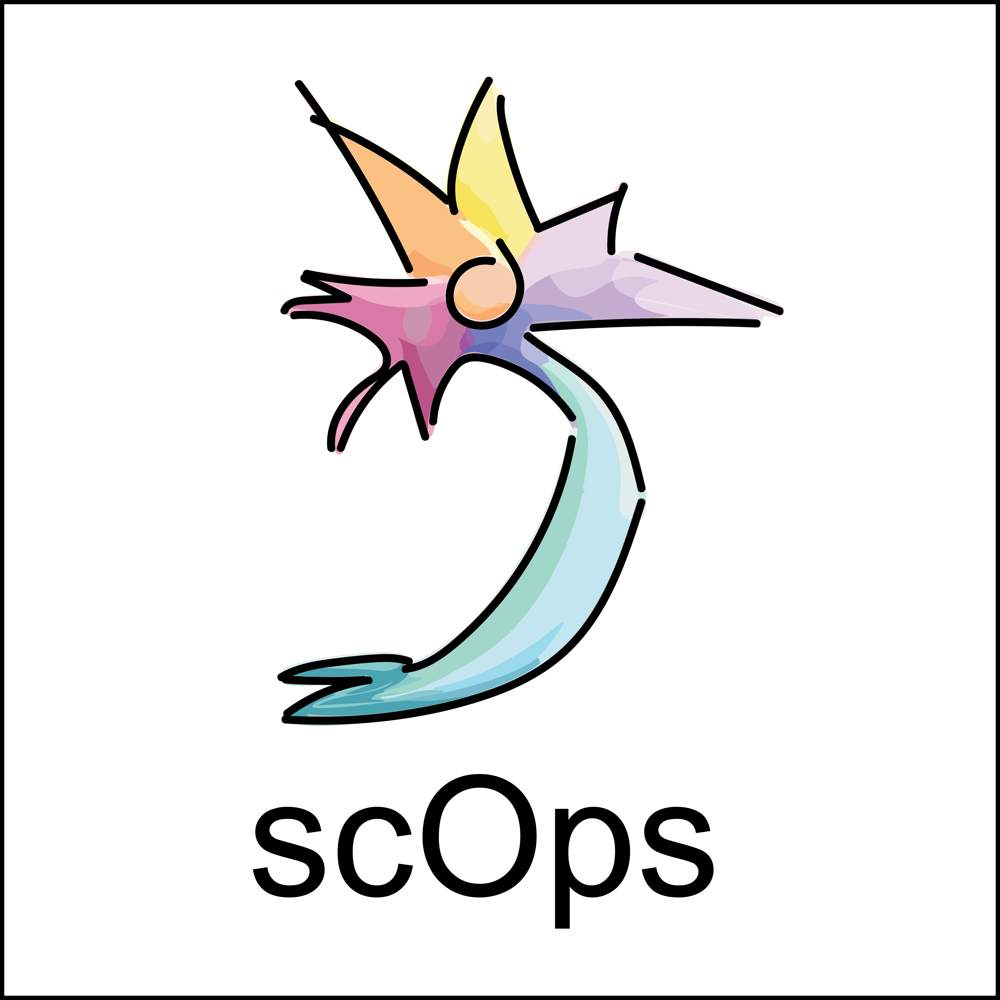

## A package for single-cell operational representations.

### scOps installation.

scOps comes in both Python and R. The implementation is virtually identical. 
Both implementations use standard objects to store the representations (*AnnData* or *SingleCellExperiment* object).

### scOps representations: BOGs, Signatures and Profiles.

scOps offers three main types of representations: Bag Of Genes, Profiles
and Signatures.

-   ***Bag Of Genes*** **(BOGs)** can be obtained via
    `scOps.compute.BOGs()` (*Python*) or `computeBOGs()` (*R*); They are
    the differentially expressed genes of a cell type/condition, with
    respect to all the others.

-   ***Signatures*** can be obtained via `scOps.compute.Signatures()`
    (*Python*) or `computeSignatures()` (*R*);
    this representation highlights the most distinctive features of each
    cell type/condition. Higher (lower) scores correspond to
    preferentially expressed (down regulated) features.

-   ***Profiles*** can be obtained via `scOps.compute.Profiles()`
    (*Python*) or `computeProfiles()` (*R*); They represent the average
    transcriptome of a given cell type/condition.

### scOps maintenance.

scOps is maintained by Carlo and Erik. Please open an issue in case
of questions or bugs. Any feedback is welcome.
